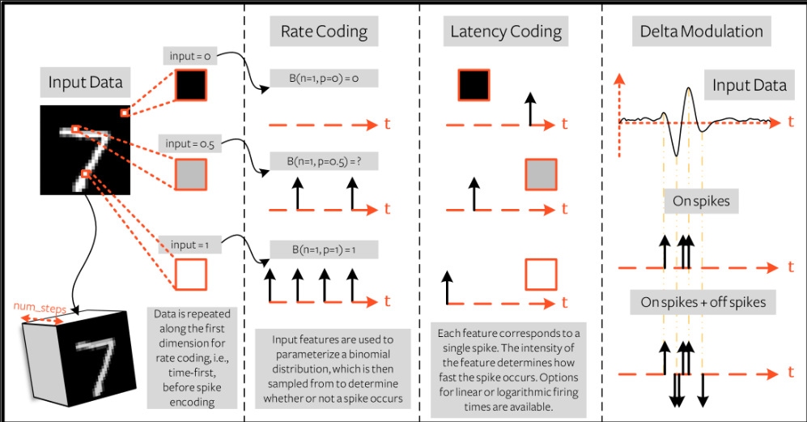

### Tutorial_1 三种脉冲编码

#### 1. Rate Coding

- 用输入特征确定  **脉冲频率**
- e.g   像素点约亮，数值越接近1，每个时间步的输入概率越大
          像素点越暗，数值越接近0，每个时间步的输入概率越小

#### 2. Latency Coding

1. 用输入特征确定 **脉冲时长**
2. e.g   像素点约亮，数值越接近1，就会在越靠前的时间步触发
           像素点越暗，数值越接近0，就会在越靠后的时间步触发

#### 3. Delta Modulation

- 用输入特征的时态 **变化** 生成脉冲
- e.g   （on-spikes）如果前后两个时间步的特征之间的差值 *为正* 且 *大于阈值$V_{thr}$* 则会产生脉冲

#### 总结

